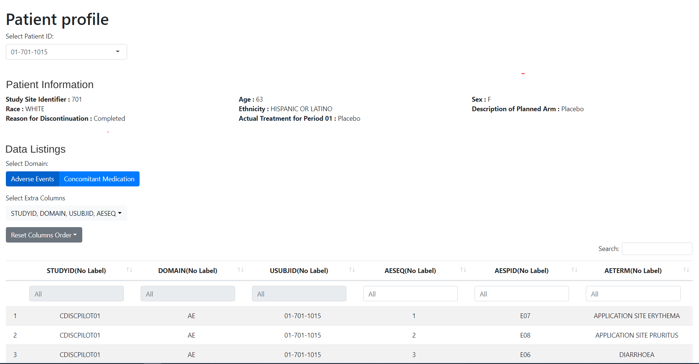

<!-- README.md is generated from README.Rmd. Please edit that file -->

# dv.papo

<!-- badges: start -->
<!-- badges: end -->

DaVinci’s `dv.papo` module shows patient information on a subject-level
basis.

It can produce listings as well as a variety of plots. Those include
events over time (adverse events, concomitant medications, …) or
point-like events (lab values, vital sign measurements, …).

It is no limited to one data source, thus it can handle data from either
ADAM, or SDTM.



Other DaVinci modules can direct `mod_patient_profile` to select and
display information associated to any particular subject ID. When the
Patient Profile is so instructed, it switches to the target subject ID
and takes focus from the application, effectively *jumping* to a patient
profile display as a result of a simple user interaction, such as a
mouse click.

## Installation

``` r
if (!require("remotes")) install.packages("remotes")
remotes::install_github("Boehringer-Ingelheim/dv.papo")
```

## Example

To use `dv.papo` inside a DaVinci app, add the module to your module
list. The code below shows an example definition of a one-item module
list. The setup of the `plots` parameter produces a plot showing Adverse
Events. <br> See `vignette("a00-papo")` for further information on how
to use `dv.papo` with `dv.manager`.

``` r
dataset_list <- list(
  "demo" = dv.papo:::prep_safety_data(5),
  "demo2" = dv.papo:::prep_safety_data(10)
)

module_list <- list(
  "Patient Profile" = dv.papo::mod_patient_profile(
    module_id = "papo",
    subject_level_dataset_name = "adsl",
    subjid_var = "USUBJID",
    summary = list(
      vars = c("SUBJID", "SITEID", "ARM", "TRTSDT", "TRTEDT", "AGE", "RACE", "SEX", "BMIBL"),
      column_count = 3L
    ),
    listings = list(
      "Concomitant Medication" = list(
        dataset = "cm"
      ),
      "Adverse Events" = list(
        dataset = "adae",
        default_vars = c("ASTDT", "ASTDY", "AENDT", "AENDY", "AEDECOD", "AESEV")
      )
    ),
    plots = list(
      timeline_info = c(trt_start_date = "TRTSDT", trt_end_date = "TRTEDT"),
      range_plots = list(
        "Adverse Events" = list(
          dataset = "adae",
          vars = c(
            start_date = "ASTDT", end_date = "AENDT",
            decode = "AEDECOD", grading = "AESEV", serious_ae = "AESER"
          ),
          tooltip = c("AE Start Day: " = "ASTDY", "AE End Day: " = "AENDY")
        )
      ),
      value_plots = list(),
      vline_vars = c("Informed Consent Date" = "RFICDT")
    )
  )
)

dv.manager::run_app(
  data = dataset_list,
  module_list = module_list,
  filter_data = "adsl"
)
```
