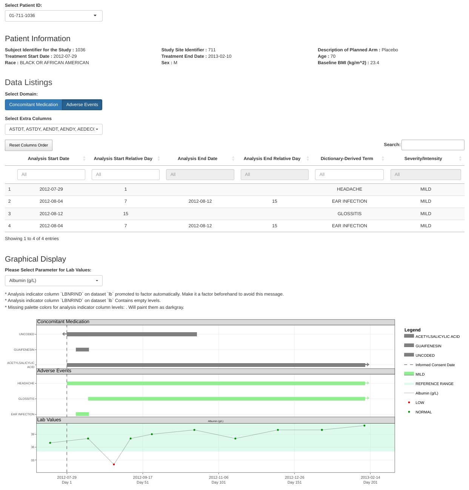
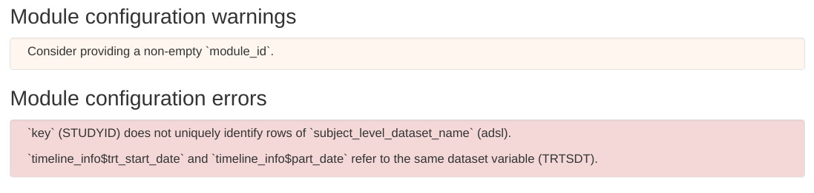
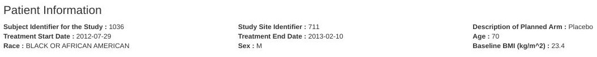
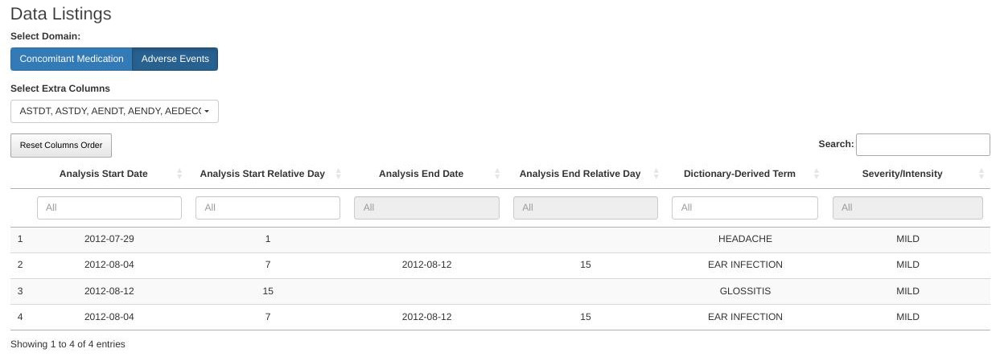
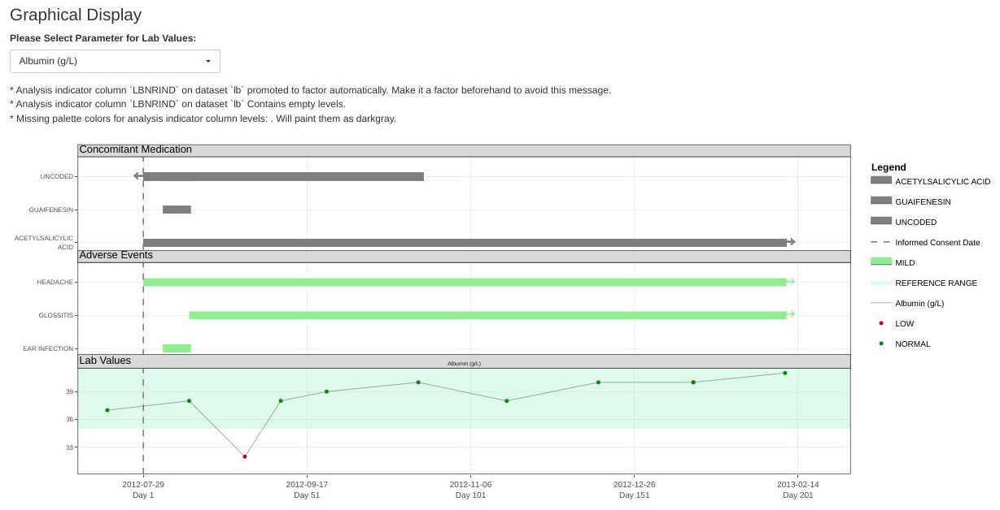

```{r, include = FALSE}
knitr::opts_chunk$set(
  eval = FALSE,
  collapse = TRUE,
  comment = "#>"
)
```

This guide will help you configure the Patient Profile module for inclusion in DaVinci apps.

## What does the Patient Profile module do?

The DaVinci Patient Profile module displays patient information on a subject-level basis.
It is divided into three sections: summary, listings, and plots.

- Summary: Snapshot of the patient's demographic information that doesn't change with visits.
- Listings: Information that changes with each visit.
- Plots: Visual depictions of events over time, such as adverse events or concomitant medication, 
  and point-like events like lab values or vital sign measurements.

The following screenshot shows the module configured to display the popular sample `safetyData` dataset.
Notice the three sections under the titles "Patient Information", "Data Listings" and "Graphical Display":

<!-- 
The following image has been generated using this bookmark:
- function to run: explorer_app(datasets = dv.papo:::prep_safety_data())
- url to restore: http://127.0.0.1:4127/?_inputs_&plots-value_plots-1-vars-analysis_date=%22ADT%22&plots-value_plots-1-vars-analysis_val=%22AVAL%22&plots-value_plots-1-vars-analysis_param=%22PARAM%22&plots-value_plots-1-dataset=%22lb%22&plots-range_plots-2-tooltip-2=%22AENDY%22&plots-range_plots-2-tooltip-1=%22ASTDY%22&plots-range_plots-2-vars-serious_ae=%22AESER%22&plots-range_plots-2-vars-grading=%22AESEV%22&plots-range_plots-2-vars-decode=%22AEDECOD%22&plots-range_plots-2-vars-end_date=%22AENDT%22&plots-range_plots-2-vars-start_date=%22ASTDT%22&plots-range_plots-2-dataset=%22adae%22&plots-range_plots-1-vars-grading=%22CMDECOD%22&plots-range_plots-1-vars-decode=%22CMDECOD%22&plots-range_plots-1-vars-end_date=%22CMENDT%22&plots-range_plots-1-vars-start_date=%22CMSTDT%22&plots-range_plots-1-dataset=%22cm%22&plots-timeline_info-trt_end_date=%22TRTEDT%22&plots-timeline_info-trt_start_date=%22TRTSDT%22&listings-2-default_vars=%5B%22ASTDT%22%2C%22ASTDY%22%2C%22AENDT%22%2C%22AENDY%22%2C%22AEDECOD%22%2C%22AESEV%22%5D&listings-2-dataset=%22adae%22&listings-1-dataset=%22cm%22&summary-vars=%5B%22SUBJID%22%2C%22SITEID%22%2C%22ARM%22%2C%22TRTSDT%22%2C%22TRTEDT%22%2C%22AGE%22%2C%22RACE%22%2C%22SEX%22%2C%22BMIBL%22%5D&module_id=%22papo%22&plots-enabled=true&listings-enabled=true&summary-enabled=true&subjid_var=%22USUBJID%22&subject_level_dataset_name=%22adsl%22&manual_code=%22%22&edit_code=false&spec=%22dv.papo%3A%3Amod_patient_profile%22&listings-1=true&listings=false&summary=true&plots-vline_vars-1=%22RFICDT%22&plots-value_plots-1-vars-range_high_limit=%22A1HI%22&plots-value_plots-1-vars-range_low_limit=%22A1LO%22&plots-value_plots-1-vars-analysis_indicator=%22LBNRIND%22&plots-range_plots=true&plots-timeline_info-part_end_date-enabled=false&plots-timeline_info-icf_date-enabled=false&plots-timeline_info=true&plots=true&listings-2-default_vars-enabled=true&listings-2=true&listings-1-default_vars-enabled=false&plots-range_plots-2-tooltip=true&plots-range_plots-2-vars-serious_ae-enabled=true&plots-range_plots-2-vars-grading-enabled=true&plots-range_plots-2-vars=true&plots-range_plots-2=true&plots-range_plots-1-tooltip=true&plots-range_plots-1-vars-serious_ae-enabled=false&plots-range_plots-1-vars-grading-enabled=true&plots-range_plots-1-vars=true&plots-range_plots-1=true&summary-column_count=3&plots-palette-enabled=false&plots-vline_day_numbers-enabled=false&plots-vline_vars=true&plots-value_plots-1-tooltip=true&plots-value_plots-1-vars-summary_stats-enabled=false&plots-value_plots-1-vars-range_high_limit-enabled=true&plots-value_plots-1-vars-range_low_limit-enabled=true&plots-value_plots-1-vars-analysis_indicator-enabled=true&plots-value_plots-1-vars=true&plots-value_plots-1=true&plots-value_plots=true&papo-listings-column_selector_adae=%5B%22ASTDT%22%2C%22ASTDY%22%2C%22AENDT%22%2C%22AENDY%22%2C%22AEDECOD%22%2C%22AESEV%22%5D&papo-listings-column_selector_cm=%5B%22CMSTDT%22%2C%22CMENDT%22%5D&papo-plot_contents-LabValues=%22Albumin%20(g%2FL)%22&papo-patient_selector=%2201-711-1036%22&papo-listings-data_selector=%22adae%22&plots-vline_vars-1-name=%22Informed%20Consent%20Date%22&plots-value_plots-1-name=%22Lab%20Values%22&plots-range_plots-2-tooltip-2-name=%22AE%20End%20Day%3A%20%22&plots-range_plots-2-tooltip-1-name=%22AE%20Start%20Day%3A%20%22&plots-range_plots-2-name=%22Adverse%20Events%22&plots-range_plots-1-name=%22Concomitant%20Medication%22&listings-2-name=%22Adverse%20Events%22&listings-1-name=%22Concomitant%20Medication%22&plotly_afterplot-A=%22%5C%22papo-plot_contents-plot%5C%22%22&.clientValue-default-plotlyCrosstalkOpts=%7B%22on%22%3A%22plotly_click%22%2C%22persistent%22%3Afalse%2C%22dynamic%22%3Afalse%2C%22selectize%22%3Afalse%2C%22opacityDim%22%3A0.2%2C%22selected%22%3A%7B%22opacity%22%3A1%7D%2C%22debounce%22%3A0%2C%22color%22%3A%5B%5D%7D&_values_&counts=%7B%22plots-value_plots-1-tooltip%22%3A0%2C%22listings%22%3A2%2C%22plots-vline_vars%22%3A1%2C%22plots-range_plots%22%3A2%2C%22plots-value_plots%22%3A1%2C%22plots-range_plots-1-tooltip%22%3A0%2C%22plots-range_plots-2-tooltip%22%3A2%7D -->

 

The next section breaks down the necessary configuration steps to set up this display.

The final section shows the resulting configuration.

## How to configure the Patient Profile module?

The `mod_patient_profile` function takes several arguments, some of which are optional:

- `module_id`: This is a unique identifier for the Shiny module in your DaVinci app.

- `subject_level_dataset_name`, `subjid_var`: These are the subject-level dataset name and unique subject identifier column respectively.

- `sender_ids`: This optional parameter identifies modules that can request the display of target patient IDs. You can read more about it in the dedicated "Module Communication" article.

- `summary`, `listings`, `plots`: These optional parameters allow you to customize what information is displayed in each of the three section. Let's take a look at each of them separately.


### Incremental configuration
As will become apparent, some of these parameters have fields, and some of those fields have subfields. **The complexity of this interface reflects its flexibility, but it can prove overwhelming**. To alleviate this situation, we've made sure that **this module is functional when partially configured and provides clear and helpful error messages when accidentally misconfigured**. 

When a DaVinci application containing a misconfigured `mod_patient_profile` starts it presents descriptive instructions on how to address the problem. Here's a screenshot showing three such help messages:

If no error is displayed on application start, the blame for any unexpected problems the users encounter should fall on the authors of this module or the infrastructure providers.

This forgiving behavior makes it possible to start with a minimal empty call to `dv.papo::mod_patient_profile()` and parameterize it incrementally until a satisfactory configuration is reached.

### The `summary` parameter

The `summary` parameter is a list that allows to customize the subject-level summary section. It is composed of:

- `vars`: These are the values you want to display in the this section. They index into the dataset specified by `subject_level_dataset_name`.
- `column_count`: This is the number of columns for the summary section.

Recall the summary section of the sample image at the beginning of this article:


The parameterization that generates that section is:
```
summary = list(
  vars = c("SUBJID", "SITEID", "ARM", 
           "TRTSDT", "TRTEDT", "AGE", 
           "RACE",   "SEX",    "BMIBL"),
  column_count = 3
)
```
We've broken the `vars` field into three lines to highlight the one-to-one mapping between each var and the their counterpart on the image.

The bold-faced descriptions of the variables are extracted from the `label` column attribute already present in the dataset.

### The `listings` parameter

The `listings` parameter is a named list of elements to include as listings in the "Data Listing" section.

Recall the listings section in the sample image at the beginning of this article:


The parameterization that generates that section is:
```
listings = list(
  "Concomitant Medication" = list(
    dataset = "cm"
  ),
  "Adverse Events" = list(
    dataset = "adae",
    default_vars = c("ASTDT", "ASTDY", "AENDT", "AENDY", "AEDECOD", "AESEV")
  )
)
```
Notice how the names on the list (`"Concomitant Medication"` and `"Adverse Events"`) are used as the labels in the blue "Domain" selector.
The mandatory `dataset` field indicates which domain to display under which heading. The optional `default_vars` is the initial selection
of "Columns" to display on the listing. The user can modify that selection.

The bold-faced listing headings are extracted from the `label` column attribute already present in the dataset.


### The `plots` parameter

The plots parameter is a named list of elements to include as plots in the "Graphical Display" section.

Recall the plots section in the sample image at the beginning of this article:

The parameterization that generates that section is:
```
plots = list(
    timeline_info = c(trt_start_date = "TRTSDT", trt_end_date = "TRTEDT"),
    range_plots = list(
      "Concomitant Medication" = list(
        dataset = "cm",
        vars = c(start_date = "CMSTDT", end_date = "CMENDT", decode = "CMDECOD", 
                 grading = "CMDECOD"),
        tooltip = c()
      ),
      "Adverse Events" = list(
        dataset = "adae",
        vars = c(start_date = "ASTDT", end_date = "AENDT", decode = "AEDECOD", 
                 grading = "AESEV", serious_ae = "AESER"),
        tooltip = c("AE Start Day: " = "ASTDY", "AE End Day: " = "AENDY")
      )
    ),
    value_plots = list(
      "Lab Values" = list(
        dataset = "lb",
        vars = c(analysis_param = "PARAM", analysis_val = "AVAL", analysis_date = "ADT", 
                 analysis_indicator = "LBNRIND", range_low_limit = "A1LO", range_high_limit = "A1HI"),
        tooltip = c()
      )
    ),
    vline_vars = c("Informed Consent Date" = "RFICDT")
  )
```
As with the two previous sections, there is a clear mapping between the `plot` fields and their effect on the displayed charts. 
Here's a brief summary of those fields:

- `timeline_info` configures the extent of the horizontal time axis.
- `range_plots` and `value_plots` describe which plots to include.
- `vline_vars` and `vline_day_numbers` (optional and not used in the example) add extra vertical markers that run through all plots.
- `palette` (optional and not used in the example) is used to fine-tune the color of points, ranges and vertical markers on plots. For Adverse Events and Concomitant Medication plots, if a palette is provided, it's checked to
see if colors are stated for all grading values. If not, then the grading values without colors, are assigned a complementary color. When a palette isn't provided, colors are automatically assigned to grading values internally.

And here's a more detailed account of their properties:

#### The `plots/timeline_info` field
The `timeline_info` field is a list of date variables in the dataset specified by the `subject_level_dataset_name` parameter. The two mandatory
subfields are:

- `trt_start_date`: Treatment Start Date, used also as Day 1 Reference Date to derive Study Day numbers.
- `trt_end_date`: Treatment End Date. 

There are two additional optional subfields:

- `icf_date`: Informed Consent Form signing Date.
- `part_end_date`: Participation End Date. 

They usually envelop and extend the treatment start-end time range. Including them expands the horizontal time range of the plots.

#### The `plots/range_plots` field
The `range_plots` field is a named list of elements to include as plots for range-like events (adverse events, concomitant medications, etc.). Each of them has three members:

- `dataset`: Dataset name from which to pull the information.
- `vars`: Variables of interest for the event. They index into `dataset`:

  - `start_date` and `end_date`: Beginning and end of the range.
  - `decode`: Description of the event.
  - `grading`: Intensity of the event. Used for color-coding ranges.
  - `serious_ae`: Marker of serious adverse event. Overlays a `SAE` legend on top of events that require special attention.

- `tooltip`: Defines a block of text to display as hover information over the left edge of each range. It is specified as a named list of `dataset` variable names. The names of this list are included as literal text and honor three basic HTML formatting elements: `<b>`, `<i>`, `<br>`. The columns the values refer to are populated with the value on the dataset relevant to any given row.

#### The `plots/value_plots` field
The `value_plots` field is a named list of elements to include as plots for value-like traces (lab measurements, vital signs, etc.). Each of them has three members:

- `dataset`: Dataset name from which to pull the information.
- `vars`: Variables of interest for the event. Only the first three are mandatory. They index into `dataset`:

  - `analysis_param`: Variable describing the parameter to plot.
  - `analysis_val`: Value associated to each time point.
  - `analysis_date`: Date of sample collection.
  - `analysis_indicator`: Used for color-coding the marker on the plot. Usually indicates whether a value is inside or outside of range.
  - `range_low_limit`: Lower limit of the range considered normal for this particular parameter.
  - `range_high_limit`: Higher limit of the range considered normal for this particular parameter.
  - `summary_stats` : This variable supplements `analysis_val` and is useful for datasets that have more than one measurement per `analysis_date`. It should point to a variable that summarizes all measurements on a single visit through a centrality calculation (mean, median, etc.).

- `tooltip`: Defines a block of text to display as hover information over the left edge of each range. It is specified as a named list of `dataset` variable names. The names of this list are included as literal text and honor three basic HTML formatting elements: `<b>`, `<i>`, `<br>`. The columns the values refer to are populated with the value on the dataset relevant to any given row.

#### The `plots/vline_vars` field
The `vline_vars` field places vertical dashed lines on days indicated by this dataset columns. It indexes into the dataset `subject_level_dataset_name` and expects values of type `integer`, `Date` or `POSIXt`.

#### The `plots/vline_day_numbers` field
The `vline_day_numbers` field requires a vector of integers, representing CDISC (non-zero) Study Days. It places vertical dashed lines on the positions corresponding to those days.

#### The `plots/palette` field
The `palette` field requires a named list of colors. If a name on this list matches the text on a plot element, the associated color will be applied to that element. This mapping takes precedence over the built-in palette. It contains either an HTML (#xxxxxx) or an R color. As an example, if the desired color for an element tagged "Relevant" is yellow and for another tagged "Irrelevant" is gray, this would be the appropriate palette definition:
```
palette = c("Relevant" = "yellow", "Irrelevant" = "gray")
```

## Complete sample configuration

As promised, here's the configuration resulting from aggregating all the previous steps:

```
dv.papo::mod_patient_profile(
  module_id = "papo",
  subject_level_dataset_name = "adsl",
  subjid_var = "USUBJID",
  summary = list(
    vars = c("SUBJID", "SITEID", "ARM", "TRTSDT", "TRTEDT", "AGE", "RACE", "SEX", "BMIBL"),
    column_count = 3L
  ),
  listings = list(
    "Concomitant Medication" = list(
      dataset = "cm"
    ),
    "Adverse Events" = list(
      dataset = "adae",
      default_vars = c("ASTDT", "ASTDY", "AENDT", "AENDY", "AEDECOD", "AESEV")
    )
  ),
  plots = list(
    timeline_info = c(
      trt_start_date = "TRTSDT",
      trt_end_date = "TRTEDT"
    ),
    range_plots = list(
      "Concomitant Medication" = list(
        dataset = "cm",
        vars = c(
          start_date = "CMSTDT",
          end_date = "CMENDT",
          decode = "CMDECOD",
          grading = "CMDECOD"
        ),
        tooltip = c()
      ),
      "Adverse Events" = list(
        dataset = "adae",
        vars = c(
          start_date = "ASTDT",
          end_date = "AENDT",
          decode = "AEDECOD",
          grading = "AESEV",
          serious_ae = "AESER"
        ),
        tooltip = c(
          "AE Start Day: " = "ASTDY",
          "AE End Day: " = "AENDY"
        )
      )
    ),
    value_plots = list(
      "Lab Values" = list(
        dataset = "lb",
        vars = c(
          analysis_param = "PARAM",
          analysis_val = "AVAL",
          analysis_date = "ADT",
          analysis_indicator = "LBNRIND",
          range_low_limit = "A1LO",
          range_high_limit = "A1HI"
        ),
        tooltip = c()
      )
    ),
    vline_vars = c(
      "Informed Consent Date" = "RFICDT"
    )
  )
)
```
